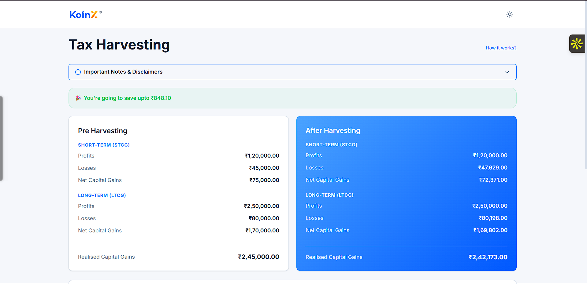
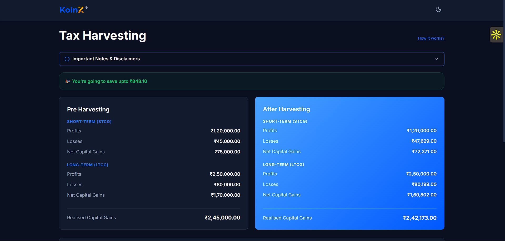
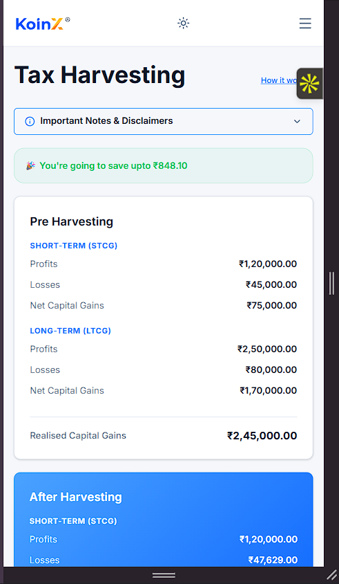
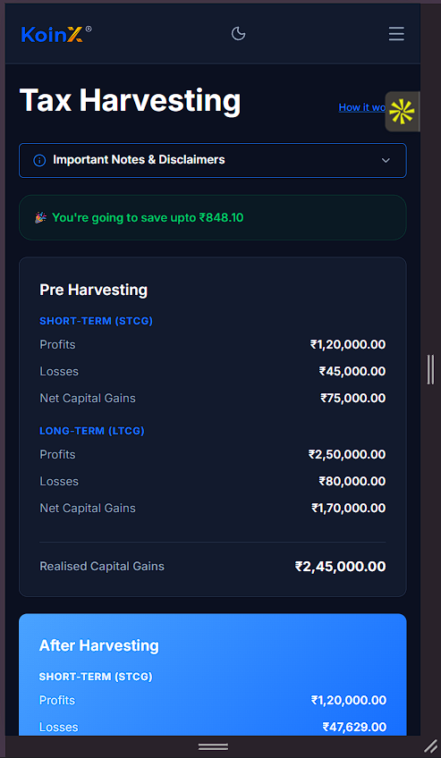

# Tax Loss Harvesting

A frontend dashboard that lets users visualize their capital gains, select crypto holdings to harvest, and instantly see how their tax liability changes. Built as a KoinX assignment.

---

## Demo

**Live:** https://tax-harvesting-koin-x.vercel.app/

---

## Preview

### Desktop





### Mobile





---

## Features

- View pre-harvesting and after-harvesting capital gains side by side
- Select individual holdings or select all — after-harvest numbers update instantly
- Savings banner shows up only when harvesting actually reduces your gains
- Responsive layout — desktop shows all columns, mobile collapses to the essentials
- Dark mode and light mode with proper KoinX logo variants for each
- Important Notes accordion with smooth expand/collapse animation
- Mock API calls with a 500ms delay and loading skeleton states
- Currency formatted in INR with commas (Indian numbering system)

---

## Tech Stack

| Tool | Why |
|------|-----|
| React | Component-based UI, hooks for state management |
| TypeScript | Type safety across props, API responses, and calculations |
| Tailwind CSS v4 | Utility classes + CSS variables for theming |
| Framer Motion | Page transitions and accordion animations |
| Vite | Fast dev server and builds |

---

## Project Structure

```
src/
├── components/
│   ├── cards/
│   │   └── SummaryCard.tsx        # reused for both pre and after harvest
│   ├── holdings/
│   │   ├── HoldingRow.tsx         # single table row with checkbox
│   │   └── HoldingsTable.tsx      # table + header + skeletons + view all
│   └── layout/
│       ├── Header.tsx
│       ├── Navbar.tsx             # logo + theme toggle
│       └── NotesAccordion.tsx
├── data/
│   ├── holdings.json
│   └── capitalGains.json
├── hooks/
│   └── useHarvesting.ts           # fetches data, manages selection, calculates gains
├── pages/
│   └── TaxDashboard.tsx           # main page, wires everything together
├── services/
│   └── mockApi.ts                 # fake API with delay
├── styles/
│   ├── globals.css
│   └── theme.css                  # CSS variables for light/dark
├── types/
│   └── index.ts                   # Holding, CapitalGain, STCG, LTCG
└── utils/
    └── formatCurrency.ts          # INR formatting helper
```

---

## Setup

```bash
# install dependencies
npm install

# start dev server
npm run dev

# production build
npm run build

# lint
npm run lint
```

Dev server runs on `http://localhost:5173` by default.

---

## Logic Used

### Pre Harvesting

The pre-harvest card pulls data directly from the capital gains API. It shows short-term and long-term profits, losses, net gains, and the total realised capital gains.

```
net capital gains = profits - losses
realised = net STCG + net LTCG
```

### After Harvesting

When you select holdings in the table, their unrealised P&L gets added to the base capital gains:

- If a holding has a **loss**, it increases the losses bucket (short-term or long-term depending on the ticker)
- If a holding has a **profit**, it increases the profits bucket

The after-harvest card recalculates everything based on these updated numbers.

### Savings

Savings are shown only when the total realised gains actually decrease after harvesting. The banner at the top (`🎉 You're going to save upto ₹X`) appears conditionally.

### Short-term vs Long-term

I'm classifying based on ticker — `BTC`, `ETH`, `SOL`, `MATIC` are treated as short-term, the rest as long-term. In a real app this would come from the backend based on actual holding dates.

---

## Assumptions

- Amount to sell is always the full holding quantity (no partial sell input yet)
- Short-term / long-term is determined by ticker name, not actual holding period
- The savings value in `holdings.json` is pre-calculated at 30% of the loss amount
- Mobile view hides Current Value, Short-Term, Long-Term, and Amount Sell columns
- All data is mocked locally with static JSON files and a simulated 500ms network delay
- Holdings with `savings > 0` are pre-selected on initial load to show the harvest scenario
- The table shows a max of 6 rows with a "View All Holdings" button (not yet functional)

---

## Things I would improve with more time

- Add unit tests for the calculation logic in `useHarvesting`
- Let users input a custom quantity to sell instead of all-or-nothing
- Make the "View All Holdings" button actually expand the table
- Add sorting and filtering on the holdings table
- Persist theme preference in localStorage
- Connect to a real backend instead of static JSON
- Add proper error boundaries
- Add keyboard navigation for the table checkboxes
- Better mobile UX — maybe a card-based layout instead of a table on small screens

---

## Notes

Built by closely following the assignment requirements and reference screenshots. Focused on keeping the interactions responsive and the code straightforward — components are kept small, state lives in one hook, and the dashboard just wires things together.
